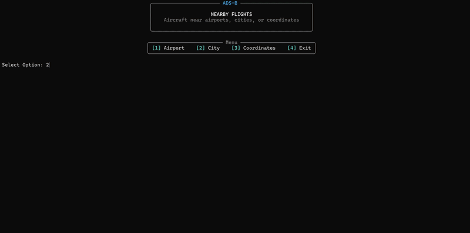

# NearbyFlightsCLI



NearbyFlightsCLI is a Python terminal application that lets users choose a pre-registered city, airport, or custom coordinates and display nearby live aircraft in the terminal.

The application queries aircraft within a default radius of 100 nautical miles from the selected location and displays the results in a formatted table. The table includes information such as flight/callsign, aircraft type, registration, altitude, speed, vertical rate, distance, and last-seen time.

## Data Source

NearbyFlightsCLI uses live ADS-B data from the public ADSB.lol API.

[ADS-B](https://en.wikipedia.org/wiki/Automatic_Dependent_Surveillance%E2%80%93Broadcast), or Automatic Dependent Surveillance–Broadcast, is a system where aircraft broadcast telemetry such as position, altitude, speed, and identification data. ADSB.lol collects this data through a global network of volunteer feeders.

To learn more about ADSB.lol project or contribute as a feeder, see the [ADSB.lol website](https://www.adsb.lol/).

## Installation

```bash
git clone https://github.com/vmiwa/NearbyFlightsCLI.git
cd NearbyFlightsCLI
python3 -m venv .venv
source .venv/bin/activate
pip install -r requirements.txt
python3 main.py